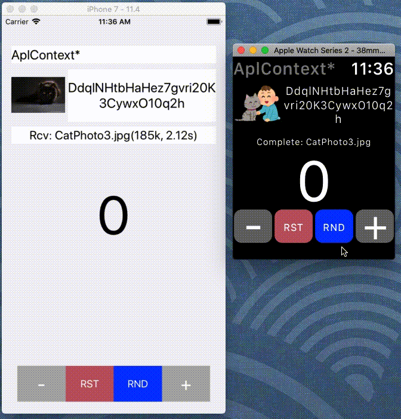
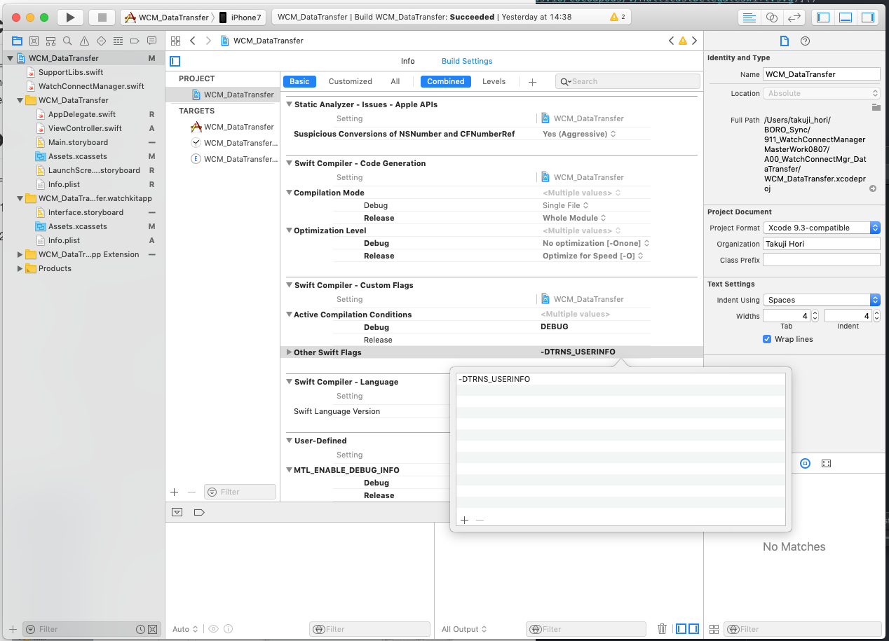

# WatchConnectManager (can Multiple Delegates)

## Overview

`"Watch Connectivity framework"` management package.    
w/Singleton, and you can use multiple Delegates.    


**[Demo Pj: WCM_ConcurrentTransfer]**


### Features
  - Easy to use `"Watch Connectivity framework"` function.
  - The format of the sending function and receiving method is unified.
  Switching (experiment) of communication means and the like can be easily performed.
  - Because it is `"Multiple Delegates"`, moderate restrictions are applied and safe and flexible design is possible.

### ToDo
  - (On actual machine) Watch side Background Function can not be confirmed.
  - Operation check with multiple Watch has not been done.
  - The correctness of MulticastDelegates implementation (especially memory management).
  I do not think there is any big mistake in interpretation, but,,,
  - There is no achievement in actual application + Demo Pj is not refined.

### Other
  - The Watch Connectivity sample is implemented by notification in general.
  There are not many examples of Multiple Delegates. Refer to as an implementation example.
  - My "WatchRealmSync" is not using WatchConnectManager yet.  I will update it in the near future.

## Installation
  - Drag `"Share module / WatchConnectManager.swift"` and store it in the target Xcode project.

## Example (WCM_TinySample)
  - An example transfer (AplContext) and file transfer (TransferFile).
  Unidirectional (iOS -> watchOS) communication.
  It is the minimum implementation using a package (no error checking)
  - See the Usage.md file for more info.

#### Sender side (iOS)

```swift:ViewController.swift
import UIKit
class ViewController: UIViewController {

    // Instantiation (+shortening)
    let WatchConnectShared = WatchConnectManager.sharedConnectManager
    var url:URL?
    @IBOutlet weak var textLabel: UILabel!

    override func viewDidLoad() {
        super.viewDidLoad()
        url = URL(fileURLWithPath:Bundle.main.path(forResource: "CatPhoto00", ofType: "jpg")!)

        // Start session
        WatchConnectShared.startSession()
    }

    // Sender
    @IBAction func sendButton(_ sender: Any) {
        // Send AplContext
        WatchConnectShared.zUpdateApplicationContext("AplCommand$$", addInfo:["My name is iOS.", Date()])
    }

    @IBAction func fileTansferButton(_ sender: Any) {
        // Send TransferFile
        WatchConnectShared.zTransferFile(url!, command: "FileCommand$$", addInfo:["CatPhoto00.jpg", Date()])
    }
}
```

#### Receiver side (watchOS)

```swift:InterfaceController.swift
import WatchKit
import WatchConnectivity
                                              // Inheritance protocol
class InterfaceController: WKInterfaceController, WatchConnectManagerDelegate {

    // Instantiation (+shortening)
    let WatchConnectShared = WatchConnectManager.sharedConnectManager

    @IBOutlet var textLabel: WKInterfaceLabel!
    @IBOutlet var imageView: WKInterfaceImage!

    override func awake(withContext context: Any?) {
        super.awake(withContext: context)

        // Start session
        WatchConnectShared.startSession()

        // Set self to delegate
        WatchConnectShared.addWatchConnectManagerDelegate(delegate: self)
    }

    // Receiver AplContext
    func receiveApplicationContext(command:String, timeStamp:Date, subInfo:[String:Any]) {

        // Check with my "command"
        if command == "AplCommand$$" {

            // Get Zero'th argument, and 01 arg
            if let string = subInfo["AplCommand$$00"] as? String,
                let date = subInfo["AplCommand$$01"] as? Date {

                  // Note: Not in main thread
                  DispatchQueue.main.async {
                    self.textLabel.setText(string + "\n\(date)")
                    self.imageView.setImage(UIImage(named: "CatImage00.png"))
                }
            }
        }
    }

    // Receive TransferFile
    func receiveTransferFile(fileURL:URL, command:String, timeStamp:Date, subInfo:[String:Any], file:WCSessionFile) {
        if command == "FileCommand$$" {
            if let fileName = subInfo["FileCommand$$00"] as? String,
                let date = subInfo["FileCommand$$01"] as? Date {

                // Get file path
                let path = fileURL.path
                DispatchQueue.main.async {
                    self.textLabel.setText(fileName + "\n\(date)")

                    // Read data and show
                    self.imageView.setImage(UIImage(data: self.readFileWithData(path: path)!))
                }
            }
        }
    }
    // File Handler etc. : Omitted !
}
```

### Considerations

  - The delegate method and reply handler are not generally main threads.
  Be careful when updating the UI at the callee.      
  - Registration delegate is saved in HashTable (weak objects).
  If the instance is destroyed it will also be deleted from the HashTable.
  " removeWatchConnectManagerDelegate" in deinit {} or didDeactivate () seems unnecessary.      

## Demo Project

We prepared 5 kinds of samples. Please check the behavior and data with Break point etc.

1. WCM_TinySample:      

  - Example code. It is a minimal implementation of unidirectional (iOS -> watchOS) communication.      
  - Perform AplContext and TransferFile.      

2. WCM_TinySample2:      

  - This is the opposite direction of WCM_TinySample. Unidirectional (watchOS- > iOS) communication.    
  - Perform SendMessage (w/Reply) and TransferFile.    
  - Test of iOS background startup by SendMessage.    

3. WCM_MultiViewController:      

  - For Multiple Delegates (MulticastDelegates) test.    
  - Perform various communication methods (AplContext / UserInfo / SendMessage / FileTransfer) on each page of iOS and watchOS.    

4. WCM_AddSubInfo:      

  - A sample that sends and receives multiple data types with addInfo / subInfo.    
  - Execute various communication methods (ApiContext, UserInfo, SendMessage (w/Reply) and FileTransfer).    
  - Check the compatibility of the sending function and receiving method.    
  - The data types to be exchanged are Date / String / Int / Double / NSArray / NSDictionary / Data (Small Capacity Icon Data).        
  - Please check subInfo data acquisition manner with "subInfoDecomp" in the code.      

5. WCM_ConcurrentTransfer:      

  - This is a demonstration of data transfer in a mixed environment that considers real applications.
  It is a demo app that simultaneously transfers multiple data (letters, numbers, small capacity image data (icon image), large volume data (photo) in both directions.      
  - Add "+/-" button to add (or subtract) 1 to the displayed number.Set it to 0 with "RST".
  Simultaneously send random character string, icon image, photo data once.
  Random data will be sent every 15 seconds with "RND" button.      
  - By setting the following to the Swift flag (-D) of PROJECT, it is possible to switch between the data transfer type and the presence or absence of File Transfer.      

    - PROJECT WCM_DataTransfer -> Build Setting, Swift Compiler - Custom Flag -> Other Swift Flags      
    - -DAPL_CONTEXT: AplContext      
    - -DTRNS_USERINFO: UserInfo      
    - -DINTRACT_MSG: SendMessage (Simpled)      
    - none (default): SendMessage (w/Reply)      
    - -DNO_FILE_TRANSFER: Suppress FileTransfer.      




## Requirements

  - WatchConnectManager was developed in Xcode Version 9.4.1.
  - iOS 11.4.1 (iPhone7), 11.4 (iOS simulator) and watchOS 4.3.2 (Series 2), 4.3 (watchOS simulator) were confirmed.

## Referenced

Thanks for sharing knowledge and resources.

1. Initial proc. and session handling / 初期処理とセッション操作    
[NatashaTheRobot / WatchConnectivitySingletonDemo.swift](https://gist.github.com/NatashaTheRobot/6bcbe79afd7e9572edf6)    
I was inspired by this Gist.

1. Multiple Delegates    
[Multicast Delegates in Swift](http://www.gregread.com/2016/02/23/multicast-delegates-in-swift/)
[Multicast Delegate and Delegates Composition](http://www.vadimbulavin.com/multicast-delegate/)    
[NSHashTableでDelegatesパターン](https://www.slideshare.net/jstarfruits/nshashtabledelegates)    

1. Code (Apple's sample)    
[QuickSwitch: Supporting Quick Watch Switching with WatchConnectivity](https://developer.apple.com/library/archive/samplecode/QuickSwitch/Introduction/Intro.html)    
[SimpleWatchConnectivity: Using the Watch Connectivity API](https://developer.apple.com/library/archive/samplecode/SimpleWatchConnectivity/Introduction/Intro.html#//apple_ref/doc/uid/TP40017663-Intro-DontLinkElementID_2)    

1. Illustration / photo image    
[かわいいフリー素材集 いらすとや](https://www.irasutoya.com)     
[Satoshi村 著作権フリーの写真](http://satoshi3.sakura.ne.jp/f_photo/f_photo.htm)    

## Author

Takuji Hori,    
agepro60@gmail.com

## License

"WatchConnectManager" is available under the MIT license. See the LICENSE file for more info.
